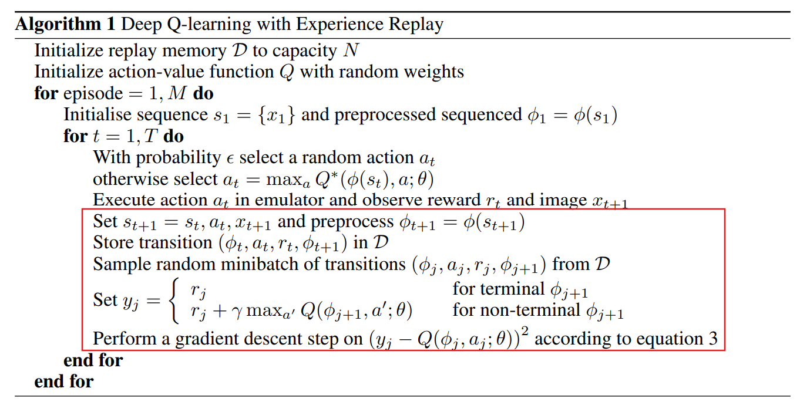

# Part 3: Implementing the DQN

## 3.0 Background:
This introduction to DQN's will be brief. If you require a more exhaustive explanation, I recommend starting with the [Hugging Face Tutorials](https://huggingface.co/learn/deep-rl-course/en/unit2/introduction) with a Focus on Unit 2 `Introduction to Q-Learning` and Unit 3 `Deep Q-Learning with Atari Games`. 

Q-Learning is a tabular based RL method which uses the Bellman Equation to find the optimal policy; it looks to find the best set of actions given state-action pairs. 

<br>
V(s) = max_a Σ P(s' | s, a) [ R(s, a, s') + γ * V(s') ]

Where:
- V(s): The value of state s.
- a: Action taken in state s.
- P(s' | s, a): Transition probability to state s' given state s and action a.
- R(s, a, s'): Reward received after transitioning from s to s' via action a.
- γ: Discount factor (0 ≤ γ < 1).
<br>

Take a look at the following example below, which provides an example of tabular Q-Learning to build your intuition on what is actually happening. As we explore new states, we update the Q-Table, which is known as value iteration. For an large number of iterations, we will approach the optimal policy by following the maximum Q values in each state-action transition. 


Deep Q-Networks (DQNs) are an extension to the generic Q-Learning, which arises as representations for a state become more complex. In the above example, notice how large the table for tracking Q-values is for 6 states. Imagine how many states would need to be stored for our example, which out of the box has an observation space of `Box(0, 255, (96, 96, 3), uint8)`. This expands to `256^(96 * 96 * 3) = 2^221,184` which is far beyond our ability to store. So what do we do? We can use a neural network to approximate the Q-Table! 

**👉Helping Hand:👈**
Before continuing on, read the original DQN paper (`mnih2013playingatarideepreinforcement`). The below steps are a brief summary of steps seen in that paper, so it will be to your advantage to read and understand this work. If you are stuck implementing a particular section conceptually, visit this paper first. 

## 3.1 Wrapping the Environment
Before constructing the agent, lets first take a look at instantiating the environment. In gym this is done with the line `env = gym.make(<name>, ...)`. However, just because an environment exists, does not guarantee that the observations coming from this environment are optimal for your agent's learning. 

Implement `wrap_env` in `RL_Car_Racing/utils.py` to augment the representation of the state to aid in the agent's learning. 

## 3.2 Creating the Q-Network
As we touched on in `3.0 Background`, we are going to use a Neural Network to approximate out Q-Table. The goal of this network is to map an image to a vector of Q values for each possible action Make your way to `RL_Car_Racing/models/dqn.py`, and implement the `QNetwork` class. 

If you have no experience with PyTorch I would recommend viewing the [PyTorch Documentation](https://pytorch.org/tutorials/beginner/basics/intro.html), and towards a worked example such as the [CIFAR Classifier Tutorial](https://pytorch.org/tutorials/beginner/blitz/cifar10_tutorial.html) or this slighting more involved Medium article working with the [MNIST Dataset](https://medium.com/@myringoleMLGOD/simple-convolutional-neural-network-cnn-for-dummies-in-pytorch-a-step-by-step-guide-6f4109f6df80). 

## 3.3 What is Experience Replay?
Experience replay is a method by which the agent can store its experiences and then call upon them in to learn from. But why do this, why not just learn online? There are many ways to think about it, one intuitive one is that without it, the experiences of the agent will be too tied to the actions it takes. If the agent choses to go left, then online Q-learning may learn disproportionally from observations on the left hand side. With experience we can attempt to nullify these effects. 

## 3.4 Creating a DQN Agent
Now it is time to connect the Q-Network and Experience Replay into a fully functioning RL agent. This will involve choosing actions, updating out Q-Network, and storing new memories by filling out the functions at `RL_Car_Racing/models/dqn.py`. The docstrings in each function and comments should guide you through this. 

### 3.4.1 Balancing exploration & exploitation with an epsilon-greedy strategy
In `selectAction()`, you will be implementing an epsilon-greedy strategy. The idea here is that with some probabilistic chance, you will select a random action. Why might this be advantageous? 

### 3.4.2 Should the ratio of exploration & exploitation change over time?
When you are learning a new task, do you immediately take the correct action? I know I don't. Something I may do is really explore my options early on, and as I learn to discover what works, I take correct actions more often. You will be implementing this idea in `_espilonDecay()`

### 3.4.3 Training the Model 
After filling out all supporting modules, complete the `__call__()` functionality of `DQNAgent`. Reference the docstring of the function as well as highlighted sections from the original DQN algorithm:

<figure>
    
</figure>

## 3.5 Hints
These are only meant to help if you are stuck. Attempt to learn the core algorithm before looking into these. 

<details>
<summary>3.5.1 Guiding the Policy</summary>
There are two functionalities one can use to try and speed up training that sigificantly increased sample efficiency for me. 

1. **Early Termination** <br>
Taking random actions in the middle is very inefficent. If your car takes too many poor qualities actions early on you can be on the road and lose the reward signal, leading to slow learning or poor learning. <br> You can urge the agent to learn more effectively by cutting an episode short if too many negative actions are received in a row, so you don't pollute your replay memory with experiences of the car doing donuts in the middle of the grass. 

2. **Skip the Start** <br>
Visualize the frames at the start of the epsiode, roughly the first 30-50 frames are just zooming in on the agent. Skip these at the beginning of the episode.  
<br>
</details>

<details>
<summary>3.5.2 A Successful Action Space</summary>
There are likely many possible action spaces, but this one worked for me. I found that maxing out the actions (max speed, max turns, max breaks) just lent itself to the agent spinning out. To combat this, provide less aggressive actions. 

```python3
ACTION_SPACE: List[np.ndarray] = [
        np.array([    0, 0.8,    0]), # all gas, no break
        np.array([    0, 0.6,    0]), # all gas, no break
        np.array([    0, 0.4,    0]), # all gas, no break
        np.array([-0.67,   0,    0]), # soft left
        np.array([ 0.67,   0,    0]), # soft right
        np.array([-0.33,   0,    0]), # softer left
        np.array([ 0.33,   0,    0]), # softer right
        np.array([    0,   0,  0.3]), # break
        np.array([    0,   0, 0.15]), # break
        np.array([    0,   0,    0])  # do nothing
    ]
```

</details> 

<details>
<summary>3.5.3 Prioritized Experience Replay</summary>
<br>
Experience replay is a uniform sampling from memory, however, why not prioritize some memories? Intuitively, it would make sense that some experiences are better to learn from than others?

Try prioritizing samples in the experience replay with some scheme using the `weights` parameter from `random.choices`. In the paper where it was introduced (schaul2016prioritizedexperiencereplay) they used a scheme involving temporal difference, but it does not need to be that complicated. 
</details>


## Sources
```
@misc{mnih2013playingatarideepreinforcement,
      title={Playing Atari with Deep Reinforcement Learning}, 
      author={Volodymyr Mnih and Koray Kavukcuoglu and David Silver and Alex Graves and Ioannis Antonoglou and Daan Wierstra and Martin Riedmiller},
      year={2013},
      eprint={1312.5602},
      archivePrefix={arXiv},
      primaryClass={cs.LG},
      url={https://arxiv.org/abs/1312.5602}, 
}
```
```
@misc{schaul2016prioritizedexperiencereplay,
      title={Prioritized Experience Replay}, 
      author={Tom Schaul and John Quan and Ioannis Antonoglou and David Silver},
      year={2016},
      eprint={1511.05952},
      archivePrefix={arXiv},
      primaryClass={cs.LG},
      url={https://arxiv.org/abs/1511.05952}, 
}
```

